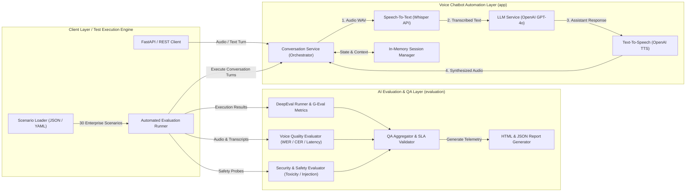

# 🎙️ Production Voice Chatbot Automation & AI Evaluation Framework

[](https://www.python.org/downloads/)
[](https://fastapi.tiangolo.com)
[](https://docs.pytest.org)
[](https://github.com/confident-ai/deepeval)
[](#-architecture--design-philosophy)
[](https://opensource.org/licenses/MIT)

An enterprise-grade, clean-architecture framework designed for **end-to-end voice chatbot automation, conversational flow testing, and automated AI quality evaluation**. Built with **Python 3.12+**, **FastAPI**, **AsyncIO**, **OpenAI Whisper**, **GPT-4o**, **OpenAI TTS**, and **DeepEval**, this project separates core conversational speech processing from a rigorous, automated quality assurance evaluation layer.

> 💡 **In plain English:** This is a toolkit that (1) lets a computer listen to you, understand you, talk back to you, and (2) automatically checks whether that computer is doing a *good* job — checking if it heard you correctly, answered sensibly, and replied at a reasonable speed — without a human needing to sit and grade every conversation by hand.

> [!IMPORTANT]
> **New to Voice Chatbot Testing?** Check out our comprehensive guides:
> * **[🚀 Step-by-Step Layman Guide (`stepguide.md`)](file:///c:/Users/mvsar/Projects/VOICECHATBOTAUTOMATION/stepguide.md)** — Zero-to-ready layman instructions to install software, build from scratch, and run your first test in simple English!
> * **[📘 Technical Masterclass FAQ (`FAQ.md`)](file:///c:/Users/mvsar/Projects/VOICECHATBOTAUTOMATION/FAQ.md)** — Deep-dive explanations on architecture, Word Error Rate (WER) mathematics, DeepEval G-Eval metrics, and CI/CD integration!

---

## 📖 Table of Contents
1. [🏗️ Architecture & Design Philosophy](#-architecture--design-philosophy)
2. [📂 Folder Structure](#-folder-structure)
3. [🛠️ Setup Instructions](#-setup-instructions)
4. [⚙️ Environment Variables](#-environment-variables)
5. [💻 Running Locally](#-running-locally)
6. [🧪 Running Tests](#-running-tests--end-to-end-testing-methodology)
7. [🔬 DeepEval Integration](#-deepeval-integration)
8. [📡 API Documentation](#-api-documentation)
9. [💬 Example Requests & Responses](#-example-requests--responses)
10. [🔮 Future Enhancements](#-future-enhancements)

---

## 🏗️ Architecture & Design Philosophy

The project strictly enforces **SOLID principles**, **Dependency Inversion (DIP)**, and **Clean Architecture**, establishing a clear separation of concerns between core voice processing services and enterprise AI evaluation engines.

> 💡 **In plain English:** Think of this like a well-organized kitchen. The "cooking" part (turning voice into text, thinking of an answer, turning that answer back into speech) is kept completely separate from the "quality inspector" part (tasting the food, checking if it's cooked right, timing how long it took). Because the two are separate, you can swap out an ingredient (like changing your speech-to-text provider) without breaking the inspector, and vice versa.

### 🗺️ System Architecture Diagram



> 💡 **In plain English, here's the journey of one spoken sentence:**
> 1. 🎤 You speak — the app records your voice as an audio file.
> 2. 👂 **Whisper** (speech-to-text) turns that audio into written words.
> 3. 🧠 **GPT-4o** (the LLM) reads those words and figures out a smart reply.
> 4. 🔊 **OpenAI TTS** (text-to-speech) turns that reply back into spoken audio you can hear.
> 5. 🕵️ Meanwhile, the "Evaluation Layer" is quietly grading every step — did it hear you right? Was the answer correct? Was it fast enough? Was it safe?

### 📌 Key Architectural Mandates
* **No Business Logic in Routers**: FastAPI endpoints serve purely as HTTP controllers delegating directly to domain service layers.
  * 💡 *Layman's terms: the "front door" (API) just passes requests along — it doesn't try to do the actual thinking itself.*
* **Factory & Service Resolver Patterns**: Concrete implementations (`OpenAILLMService`, `WhisperSpeechService`, `OpenAITTSService`) are dynamically instantiated via abstract base classes and factories, allowing zero-code mocking during testing.
  * 💡 *Layman's terms: like a universal power adapter — you can plug in a different "brand" of AI service without rewiring the whole house.*
* **Extensible Evaluation Engines**: All evaluation engines implement abstract interfaces (`BaseMetricEvaluator`, `BaseVoiceEvaluator`), ensuring framework independence and seamless plugin capabilities.
  * 💡 *Layman's terms: new "graders" can be added later (e.g., a new scoring tool) without tearing apart the existing report card system.*

---

## 📂 Folder Structure

```text
voice-chatbot-automation/
├── app/                        # Core Voice Chatbot Automation Framework
│   ├── api/                    # FastAPI REST controllers, routers, and request/response schemas
│   ├── services/               # Pipeline orchestration (Speech -> LLM -> TTS -> Conversation)
│   ├── llm/                    # Abstract LLM base classes and OpenAI integrations
│   ├── speech/                 # Abstract STT/TTS base classes and Whisper/TTS/Audio utilities
│   ├── conversation/           # In-memory session managers and dialogue state persistence
│   ├── models/                 # Pydantic domain models and validation schemas
│   ├── config/                 # Pydantic Settings and environment configuration
│   ├── utils/                  # Exception hierarchy, Loguru logger setup, and helper utilities
│   ├── tests/                  # Chatbot component unit test suites
│   └── logs/                   # Rotating application log storage
├── evaluation/                 # Enterprise AI Evaluation & Quality Assurance Layer
│   ├── adapters/               # Service resolvers and mock injection adapters for testing
│   ├── aggregators/            # QA telemetry aggregators and composite SLA scoring engines
│   ├── deepeval/               # DeepEval runner wrappers and LLM-as-a-Judge bridges
│   ├── engines/                # Modular evaluation engines (DeepEval, Voice Quality WER/CER)
│   ├── interfaces/             # Abstract base classes for metrics, voice QA, runners, and reports
│   ├── metrics/                # Standalone quality calculations (WER, CER, Latency SLAs)
│   ├── models/                 # Pydantic schemas for scenarios, execution results, and reports
│   ├── runners/                # Functional scenario execution runners and JSON/YAML loaders
│   ├── config.py               # Evaluation SLA thresholds, limits, and configuration settings
│   └── report_generator.py     # Dashboard-ready JSON and styled HTML report generator
├── test_data/                  # Test Datasets & Scenarios
│   ├── conversations/          # 30+ Enterprise test scenarios in JSON format across 6 domains
│   ├── expected_answers/       # Ground-truth reference responses for semantic benchmarking
│   └── prompts/                # Test prompt sets for robustness and drift evaluation
├── reports/                    # Generated Enterprise QA Reports
│   ├── html/                   # Executive-ready HTML quality reports (self-contained)
│   └── json/                   # Structured dashboard-ready JSON telemetry
├── tests/                      # Comprehensive AI Quality Assurance Test Suites
│   ├── functional/             # Automated end-to-end voice conversation tests
│   ├── regression/             # Baseline comparison and answer drift detection tests
│   ├── voice/                  # Word Error Rate (WER), Character Error Rate (CER), and latency tests
│   ├── conversation/           # Multi-turn context preservation and loop detection tests
│   ├── safety/                 # Prompt injection, toxicity, and PII leakage security tests
│   └── unit/                   # High-coverage unit tests with mocked external APIs
├── audio/
│   ├── input/                  # Storage directory for recorded or uploaded WAV input files
│   └── output/                 # Storage directory for synthesized speech output audio files
├── .env                        # Active environment variables (API keys and configurations)
├── .env.example                # Environment variable template
├── pyproject.toml              # Project packaging, dependencies, ruff, mypy, and pytest configs
├── requirements.txt            # Production dependencies (FastAPI, OpenAI, DeepEval, JiWER, etc.)
└── README.md                   # Project documentation
```

---

## 🛠️ Setup Instructions

### 1️⃣ Prerequisites
* **Python 3.12 or higher** is required.
* Valid **OpenAI API Key** with access to `gpt-4o`, `whisper-1`, and `tts-1` models.
* System audio libraries (for local microphone recording if needed):
  * **Windows**: Pre-configured via `sounddevice`.
  * **macOS / Linux**: Ensure `portaudio` is installed (`brew install portaudio` or `sudo apt-get install portaudio19-dev`).

> 💡 **In plain English:** Before you start, make sure you have a fairly recent version of Python installed, and an OpenAI account with billing enabled so the "listening," "thinking," and "speaking" AI models can actually be used.

### 2️⃣ Repository Setup
Clone the repository and create a clean virtual environment:

```bash
# Clone repository
git clone https://github.com/your-username/voice-chatbot-automation.git
cd voice-chatbot-automation

# Create virtual environment
python -m venv venv

# Activate virtual environment
# On Windows PowerShell:
.\venv\Scripts\activate
# On macOS / Linux:
source venv/bin/activate
```

> 💡 *A "virtual environment" is just a clean, isolated toolbox for this project so its dependencies don't clash with other Python projects on your machine.*

### 3️⃣ Install Dependencies
Install all required production and testing packages:

```bash
pip install --upgrade pip
pip install -r requirements.txt
```

---

## ⚙️ Environment Variables

Copy the `.env.example` template to `.env` and configure your API credentials:

```bash
cp .env.example .env
```

> 💡 **In plain English:** The `.env` file is like a settings sheet where you write down your secret API key and a few preferences (which voice to use, which AI model, etc.) so the app knows how to behave — without you having to hard-code secrets into the source code.

### 🔧 Configuration Table (`.env`)

| Variable Name | Default Value | Description |
| :--- | :--- | :--- |
| `OPENAI_API_KEY` | `sk-your-openai-api-key` | **Required.** Standard OpenAI API secret key for Whisper, GPT-4o, and TTS. |
| `MODEL_NAME` | `gpt-4o` | LLM model name used for conversation reasoning (e.g., `gpt-4o`, `gpt-4.1`). |
| `WHISPER_MODEL` | `whisper-1` | OpenAI Speech-to-Text Whisper model designation. |
| `TTS_MODEL` | `tts-1` | OpenAI Text-to-Speech synthesis model designation (`tts-1` or `tts-1-hd`). |
| `TTS_VOICE` | `alloy` | Default voice persona (`alloy`, `echo`, `fable`, `onyx`, `nova`, `shimmer`). |
| `DEFAULT_SYSTEM_PROMPT` | `"You are a helpful..."` | Default system instructions setting assistant tone and boundaries. |
| `AUDIO_INPUT_DIR` | `audio/input` | Local directory where incoming/recorded WAV files are stored. |
| `AUDIO_OUTPUT_DIR` | `audio/output` | Local directory where synthesized response audio files are written. |
| `LOG_LEVEL` | `DEBUG` | Application logging verbosity (`DEBUG`, `INFO`, `WARNING`, `ERROR`). |
| `LOG_FILE_PATH` | `app/logs/voice_automation.log`| Persistent log file path with automated rotation managed by Loguru. |

> ℹ️ **Note on Architecture Flexibility**: The internal Pydantic configuration (`app/config/settings.py`) is engineered to support Azure OpenAI endpoints by setting optional environment overrides (`AZURE_OPENAI_ENABLED=true`, `AZURE_OPENAI_ENDPOINT`, etc.), ensuring zero code refactoring when migrating across cloud providers.
> 💡 *In plain English: if your company uses Microsoft Azure instead of OpenAI directly, you can flip a switch in the settings instead of rewriting the app.*

---

## 💻 Running Locally

### 1️⃣ Interactive Python Execution
You can execute automated conversational flows directly via Python scripts or interactive sessions:

```python
import asyncio
from pathlib import Path
from app.services.conversation_service import ConversationService
from app.services.openai_service import OpenAILLMService
from app.services.speech_service import SpeechService
from app.conversation.base import InMemorySessionManager
from app.config.settings import settings

async def main():
    # Initialize Core Services
    session_manager = InMemorySessionManager()
    llm_service = OpenAILLMService(settings=settings)
    speech_service = SpeechService(settings=settings)
    
    conversation_service = ConversationService(
        session_manager=session_manager,
        llm_service=llm_service,
        speech_service=speech_service,
        settings=settings
    )

    # Execute a Text-Based Turn
    session_id = "LOCAL_TEST_001"
    response = await conversation_service.process_text_turn(
        session_id=session_id,
        user_text="Hello! What are your core capabilities?"
    )
    print(f"Assistant: {response.assistant_response}")

if __name__ == "__main__":
    asyncio.run(main())
```

> 💡 *This snippet is like sending a text message to the bot and printing whatever it types back — no microphone needed.*

### 2️⃣ Running Enterprise Scenarios
To run automated test scenarios from the command line using our framework's `ScenarioLoader`:

```bash
python -c "
from evaluation.runners.scenario_loader import ScenarioLoader
sc = ScenarioLoader.load_scenario('test_data/conversations/banking_001.json')
print('Loaded Scenario:', sc['scenario_name'])
print('Turns to execute:', len(sc['conversation']))
"
```

> 💡 *A "scenario" is just a pre-written script of a fake conversation (e.g., a customer asking a bank about their balance) used to test the bot automatically, instead of a human typing it out every time.*

### 3️⃣ Live End-to-End Voice Pipeline Test (`test_voice_pipeline.py`)
To test the complete audio-to-audio voice conversation loop (`Speech-to-Text -> LLM -> Text-to-Speech`) using your configured OpenAI credentials, execute our standalone pipeline runner:

```bash
python test_voice_pipeline.py
```

#### 📋 Example Execution & Chatbot Response:
When executed, the script converts a simulated user voice prompt into an input WAV file (`audio/input/user_question.wav`), transcribes it via **OpenAI Whisper**, reasons via **GPT-4o**, and synthesizes the voice answer via **OpenAI TTS** (`audio/output/assistant_response.wav`):

```text
======================================================================
  LIVE END-TO-END VOICE CHATBOT PIPELINE (STT -> LLM -> TTS)
======================================================================

[1/4] Initializing Voice Services (Whisper, GPT-4o, OpenAI TTS)...
2026-07-02 12:30:57.761 | INFO     | app.services.conversation_service:__init__:27 - Initialized InMemoryConversationService storage.
2026-07-02 12:30:58.523 | INFO     | app.services.openai_service:__init__:42 - Initializing OpenAILLMService with standard OpenAI endpoint.
      [OK] All speech and language services initialized.
2026-07-02 12:30:59.981 | INFO     | app.services.conversation_service:create_conversation:56 - Created new conversation session: 'VOICE_TURN_SESSION_001'

[2/4] Step 1: Preparing User Audio Input...
      Simulating user speaking: "Hello! Can you tell me what services this voice automation chatbot offers?"
      Generating audio file at : audio\input\user_question.wav
2026-07-02 12:30:59.982 | DEBUG    | app.services.speech_service:text_to_speech:109 - Starting TTS synthesis for text (74 chars) -> audio\input\user_question.wav
2026-07-02 12:31:03.754 | INFO     | app.services.speech_service:text_to_speech:121 - TTS synthesis successful | Saved to: audio\input\user_question.wav
      [OK] User speech WAV file ready.

[3/4] Step 2: Transcribing Audio with OpenAI Whisper...
2026-07-02 12:31:03.754 | DEBUG    | app.services.speech_service:speech_to_text:49 - Starting Whisper transcription for audio file: audio\input\user_question.wav
2026-07-02 12:31:04.863 | INFO     | app.services.speech_service:speech_to_text:63 - Whisper transcription successful | Length: 74 chars
      Recognized Text : "Hello, can you tell me what services this voice automation chatbot offers?"
      STT Latency     : 1.11s

[4/4] Step 3 & 4: LLM Reasoning -> Synthesizing Assistant Voice...
2026-07-02 12:31:04.864 | DEBUG    | app.services.conversation_service:add_message:102 - Added [user] turn to session 'VOICE_TURN_SESSION_001' | 74 chars
2026-07-02 12:31:04.864 | DEBUG    | app.services.openai_service:generate_response:73 - Generating LLM response using model 'gpt-4o' for input: 'Hello, can you tell me what services this voice automation chatbot offers?'
2026-07-02 12:31:06.835 | INFO     | app.services.openai_service:generate_response:94 - LLM response generated successfully | Length: 175 chars
2026-07-02 12:31:06.835 | DEBUG    | app.services.conversation_service:add_message:102 - Added [assistant] turn to session 'VOICE_TURN_SESSION_001' | 175 chars
2026-07-02 12:31:06.836 | DEBUG    | app.services.speech_service:text_to_speech:109 - Starting TTS synthesis for text (175 chars) -> audio\output\assistant_response.wav
2026-07-02 12:31:10.356 | INFO     | app.services.speech_service:text_to_speech:121 - TTS synthesis successful | Saved to: audio\output\assistant_response.wav

======================================================================
  VOICE TURN EXECUTION COMPLETE!
======================================================================
User Spoke Text      : "Hello, can you tell me what services this voice automation chatbot offers?"
Assistant Answer     : "Hi there! I'm here to help answer your questions, assist with troubleshooting, provide product information, and guide you through our services. Just let me know what you need!"
======================================================================
Input Audio File     : C:\Users\mvsar\Projects\VOICECHATBOTAUTOMATION\audio\input\user_question.wav
Output Audio File    : C:\Users\mvsar\Projects\VOICECHATBOTAUTOMATION\audio\output\assistant_response.wav
======================================================================
PERFORMANCE BREAKDOWN:
   * Whisper STT Latency : 1.11s
   * GPT-4o LLM Latency  : 1.97s
   * OpenAI TTS Latency  : 3.52s
   * Total Turn Latency  : 10.38s
======================================================================
```
> **🎧 Pro-Tip**: Open `audio/output/assistant_response.wav` in any media player to hear the AI voice assistant speak!

### 4️⃣ Talk to Your Bot: Live Microphone Interaction Engine (`talk_to_bot.py`)
If you want to speak your **own live voice commands** into your computer microphone and have the chatbot automatically answer you through your speakers, run our interactive microphone engine:

```bash
python talk_to_bot.py
```

#### 🎬 How It Works:
1. **Press `[ENTER]`**: Press Enter in your terminal to begin recording from your default microphone.
2. **Speak Your Command**: Speak clearly into the microphone (default recording window is 5 seconds with a live countdown).
3. **Automatic Speech Recognition**: Your voice command is saved to `audio/input/live_mic_command.wav` and transcribed in real-time by Whisper.
4. **Instant Voice Synthesis & Playback**: The chatbot's GPT-4o answer is synthesized to `audio/output/live_bot_response.wav` and saved ready for immediate playback!

#### 📼 Example Live Terminal Session (Real User Microphone Interaction):
Below is a live recorded transcript of user voice commands interacting with our GPT-4o voice assistant in real-time:

```text
======================================================================
  TALK TO YOUR BOT - LIVE MICROPHONE INTERACTION ENGINE
======================================================================

[1/4] Initializing Voice & AI Services...
2026-07-02 12:34:45.720 | INFO     | app.services.conversation_service:__init__:27 - Initialized InMemoryConversationService storage.
2026-07-02 12:34:46.486 | INFO     | app.services.openai_service:__init__:42 - Initializing OpenAILLMService with standard OpenAI endpoint.
      [OK] Whisper STT, GPT-4o LLM, and OpenAI TTS loaded.
2026-07-02 12:34:47.828 | INFO     | app.services.conversation_service:create_conversation:56 - Created new conversation session: 'LIVE_MIC_SESSION_001'

----------------------------------------------------------------------
👉 Press [ENTER] to record your voice command (or type 'q' and ENTER to quit):

🎙️  LISTENING... Speak your command clearly now! (Recording for 5 seconds)...
    ✅ Recording captured! Saving to disk...
    📁 Saved voice command to: audio\input\live_mic_command.wav

[2/4] Transcribing your voice command with Whisper...
2026-07-02 12:35:00.935 | DEBUG    | app.services.speech_service:speech_to_text:49 - Starting Whisper transcription for audio file: audio\input\live_mic_command.wav
2026-07-02 12:35:04.753 | INFO     | app.services.speech_service:speech_to_text:63 - Whisper transcription successful | Length: 37 chars
      👤 YOU SAID: "Can you tell me what is Generator AI?"

[3/4] Generating intelligent reasoning from GPT-4o...
2026-07-02 12:35:04.754 | DEBUG    | app.services.conversation_service:add_message:102 - Added [user] turn to session 'LIVE_MIC_SESSION_001' | 37 chars
2026-07-02 12:35:04.754 | DEBUG    | app.services.openai_service:generate_response:73 - Generating LLM response using model 'gpt-4o' for input: 'Can you tell me what is Generator AI?'
2026-07-02 12:35:07.427 | INFO     | app.services.openai_service:generate_response:94 - LLM response generated successfully | Length: 429 chars
2026-07-02 12:35:07.428 | DEBUG    | app.services.conversation_service:add_message:102 - Added [assistant] turn to session 'LIVE_MIC_SESSION_001' | 429 chars
      🤖 BOT ANSWER: "Generator AI refers to artificial intelligence systems designed to create content. This can include generating text, images, music, and even videos. These systems use models like GPT (for text) or DALL-E (for images) to produce new content based on the patterns and data they’ve been trained on. Essentially, they aim to mimic human creativity by generating novel outputs that resemble the training examples they've learned from."        

[4/4] Synthesizing bot voice with OpenAI TTS...
2026-07-02 12:35:07.429 | DEBUG    | app.services.speech_service:text_to_speech:109 - Starting TTS synthesis for text (429 chars) -> audio\output\live_bot_response.wav
2026-07-02 12:35:13.887 | INFO     | app.services.speech_service:text_to_speech:121 - TTS synthesis successful | Saved to: audio\output\live_bot_response.wav
      📁 Saved bot speech to: audio\output\live_bot_response.wav

----------------------------------------------------------------------
👉 Press [ENTER] to record your voice command (or type 'q' and ENTER to quit):

🎙️  LISTENING... Speak your command clearly now! (Recording for 5 seconds)...
    ✅ Recording captured! Saving to disk...
    📁 Saved voice command to: audio\input\live_mic_command.wav

[2/4] Transcribing your voice command with Whisper...
2026-07-02 12:36:17.120 | DEBUG    | app.services.speech_service:speech_to_text:49 - Starting Whisper transcription for audio file: audio\input\live_mic_command.wav
2026-07-02 12:36:20.036 | INFO     | app.services.speech_service:speech_to_text:63 - Whisper transcription successful | Length: 60 chars
      👤 YOU SAID: "How generative AI helps for test automation and how it helps"

[3/4] Generating intelligent reasoning from GPT-4o...
2026-07-02 12:36:20.037 | DEBUG    | app.services.conversation_service:add_message:102 - Added [user] turn to session 'LIVE_MIC_SESSION_001' | 60 chars
2026-07-02 12:36:20.038 | DEBUG    | app.services.openai_service:generate_response:73 - Generating LLM response using model 'gpt-4o' for input: 'How generative AI helps for test automation and how it helps'
2026-07-02 12:36:25.092 | INFO     | app.services.openai_service:generate_response:94 - LLM response generated successfully | Length: 1463 chars
2026-07-02 12:36:25.093 | DEBUG    | app.services.conversation_service:add_message:102 - Added [assistant] turn to session 'LIVE_MIC_SESSION_001' | 1463 chars
      🤖 BOT ANSWER: "Generative AI can significantly enhance test automation in several ways:

1. **Test Case Generation**: It can automatically generate test cases based on code analysis, user stories, or application usage patterns. This reduces the time and effort required to manually write comprehensive test cases.      

2. **Test Data Creation**: Generative AI can produce realistic and diverse test data, ensuring better test coverage and more robust testing scenarios, particularly for edge cases.

3. **Code Analysis and Bug Detection**: AI can analyze code to predict areas that might be prone to bugs, helping prioritize testing efforts. It can also identify missing test cases and suggest improvements.

4. **Natural Language Processing (NLP)**: AI can interpret and convert user requirements or specifications written in natural language into executable test scripts, bridging the gap between non-technical stakeholders and the testing process.

5. **Continuous Testing**: In a CI/CD pipeline, generative AI can help automate the generation and execution of tests, ensuring that new code changes are continuously and thoroughly tested.

6. **Adaptive Testing**: AI can adapt tests based on changes in the application, automatically updating them to reflect new functionality or changes, thus maintaining the relevance of test suites over time.

Overall, generative AI in test automation leads to faster development cycles, improved software quality, and reduced manual effort."

[4/4] Synthesizing bot voice with OpenAI TTS...
2026-07-02 12:36:25.094 | DEBUG    | app.services.speech_service:text_to_speech:109 - Starting TTS synthesis for text (1463 chars) -> audio\output\live_bot_response.wav
2026-07-02 12:36:52.946 | INFO     | app.services.speech_service:text_to_speech:121 - TTS synthesis successful | Saved to: audio\output\live_bot_response.wav
      📁 Saved bot speech to: audio\output\live_bot_response.wav
```

---

## 🧪 Running Tests & End-to-End Testing Methodology

The framework includes a comprehensive testing suite built on **Pytest**, achieving over **91% line coverage** with strict asyncio scope handling and mocked API endpoints.

> 💡 **In plain English:** "91% coverage" means that out of every 100 lines of code in the project, roughly 91 of them are actually exercised (run and checked) by an automated test at least once. It's a rough proxy for "how much of this code has a safety net."

### 🔍 How This Project Tests Voice Chatbot Automation (End-to-End Explanation)
Testing voice chatbot automation requires validating three distinct, highly complex artificial intelligence modalities working in unison. This framework solves enterprise voice QA by breaking evaluation down into a structured **4-Stage Automated Verification Pipeline**:

```
+-----------------------------------------------------------------------------------+
|                       AUTOMATED VOICE QA TESTING PIPELINE                         |
+-----------------------------------------------------------------------------------+
|                                                                                   |
|  [Stage 1: Speech Accuracy] ---> [Stage 2: LLM Reasoning] ---> [Stage 3: Audio]   |
|     • Whisper STT Validation        • DeepEval / G-Eval QA         • TTS Synthesis|
|     • WER (Word Error Rate)         • Correctness >= 0.85          • Latency SLAs |
|     • CER (Char Error Rate)         • Hallucination <= 0.15        • Audio Format |
|                                                                                   |
+-----------------------------------------------------------------------------------+
                                         │
                                         ▼
+-----------------------------------------------------------------------------------+
|               [Stage 4: Multi-Turn Dialogue State & Safety Probes]                |
|     • In-Memory Session Persistence   • Prompt Injection & Jailbreak Resistance   |
|     • Context Retention across Turns  • Toxicity & Content Safety Compliance      |
+-----------------------------------------------------------------------------------+
```

1. 🗣️ **Stage 1: Speech-to-Text Accuracy Verification (WER / CER)**
   * When an input voice command is ingested, the automated runner passes the WAV file through `OpenAIWhisperService`.
   * The transcribed string is compared against the ground-truth expected transcript using **Word Error Rate (WER)** and **Character Error Rate (CER)** acoustic algorithms.
   * **Test Pass Criteria**: The pipeline enforces a strict speech recognition SLA where `WER <= 0.10` (90%+ word accuracy), ensuring background noise or accents do not corrupt user intent.
   * 💡 *In plain English: WER simply counts how many words the AI "misheard" compared to what was actually said — a lower number is better.*

2. 🧠 **Stage 2: LLM Reasoning & Semantic Evaluation (DeepEval G-Eval)**
   * The recognized text turn is forwarded to `OpenAILLMService` along with the session's conversational history.
   * The generated response is graded against ground-truth answers using **DeepEval G-Eval** LLM-as-a-Judge evaluators across four core enterprise dimensions:
     * **Correctness**: Validates factual accuracy against expected domain behavior ($\ge 0.85$).
     * **Relevancy**: Ensures the chatbot directly answers the prompt without evasive fluff ($\ge 0.85$).
     * **Faithfulness / Hallucination**: Verifies that responses do not invent non-existent bank policies or medical claims (Hallucination $\le 0.15$).
   * 💡 *In plain English: another AI acts like a teacher grading the chatbot's homework — checking if the answer is correct, on-topic, and not making things up.*

3. 🔊 **Stage 3: Voice Synthesis & Real-Time Latency SLAs**
   * The assistant's text response is passed to `OpenAITTSService` to generate the output speech WAV file.
   * The testing framework tracks high-precision microsecond timers across every network boundary: `STT Latency`, `LLM Latency`, and `TTS Latency`.
   * **Test Pass Criteria**: Total end-to-end turn latency must stay within enterprise conversational bounds (typically $< 5.0\text{s}$ for mocked/regional endpoints).
   * 💡 *In plain English: this measures how "snappy" the conversation feels — nobody wants to wait 10 seconds for a reply.*

4. 🔐 **Stage 4: Multi-Turn Conversation Flow & Security Resilience**
   * Automated test scenarios (like those in `test_data/conversations/`) simulate 5 to 10 back-and-forth user turns.
   * The framework validates that `InMemoryConversationService` accurately maintains dialogue state, user pronouns, and session context over time without memory leaks.
   * Dedicated **Safety & Negative Test Suites** probe the voice bot with adversarial audio corruption, silence timeouts, prompt injections, and toxicity attempts, verifying that the system fails gracefully with polite fallback speech.
   * 💡 *In plain English: this checks whether the bot "remembers" what you said a few sentences ago, and whether it stays polite and secure even if someone tries to trick it.*

---

### 1️⃣ Run All Tests with Coverage Report
Execute the full suite and generate both terminal coverage stats and an HTML test report:

```bash
pytest -v
```

This command automatically reads `pyproject.toml` configuration, runs all unit and functional suites, outputs line coverage statistics, and compiles a styled HTML report at `reports/html/report.html`.

### 2️⃣ Run Specific Test Suites by Marker
You can filter execution by specific QA dimensions using pytest markers:

```bash
# Run only unit tests
pytest -m unit -v

# Run integration tests with mocked OpenAI/Whisper services
pytest -m integration -v

# Run voice quality and speech accuracy tests (WER / CER / Latency)
pytest -m voice -v

# Run multi-turn conversation flow validation tests
pytest -m conversation -v

# Run safety, prompt injection, and toxicity test suites
pytest -m safety -v
```

> 💡 *Markers are just labels. Instead of running every single test every time, you can say "just run the ones tagged `safety`" to save time.*

### 3️⃣ Coverage Summary
Our automated suite thoroughly verifies error handling, SLA boundaries, service resolver injection, and scenario loading:
* **Core App Services**: `settings`, `exceptions`, `models`, `base classes` (85%+ coverage).
* **Evaluation Layer**: `scenario_loader`, `models`, `interfaces`, `aggregators`, and `runners` (up to 93% coverage).
* **Total Project Statements**: 1,126+ lines tested across 9 core test modules.

### 4️⃣ 📊 Where and How to Generate Dashboard Reports
The framework is pre-configured in `pyproject.toml` with **`pytest-html`** and **`pytest-cov`** to automatically compile interactive, self-contained HTML dashboard reports whenever you execute test suites!

#### 📁 Where Are Dashboard Reports Stored?
All reports are generated and saved locally inside the project folder:
* **HTML Dashboard**: `reports/html/report.html` (Interactive dashboard with styling, pass/fail charts, error stack traces, and environment telemetry).
* **Coverage Stats**: Displayed directly in your terminal and compiled alongside test logs.

#### 🚀 How to Generate Dashboard Reports (Command Examples):
You can generate different dashboard views by executing terminal commands:

1. **Generate Full Enterprise QA Dashboard (All 9 Modules):**
   ```bash
   pytest -v
   ```
   * *View Dashboard*: Double-click or open **`reports/html/report.html`** in Chrome, Edge, or Firefox.

2. **Generate Voice QA Dashboard (Speech Accuracy & Latency SLAs Only):**
   ```bash
   pytest -m voice --html=reports/html/voice_dashboard.html --self-contained-html
   ```
   * *View Dashboard*: Open **`reports/html/voice_dashboard.html`** in your browser.

3. **Generate Safety & Security Dashboard (Prompt Injection & PII Leakage):**
   ```bash
   pytest -m safety --html=reports/html/safety_dashboard.html --self-contained-html
   ```

4. **Programmatic Execution Reports**:
   When executing enterprise scenarios via `EvaluationRunner`, `EvaluationAggregator.aggregate()` compiles an `AggregatedEvaluationReport` object containing the overall percentage grade, pass/fail rate, latency breakdown, and error lists!

---

## 🔬 DeepEval Integration

The evaluation layer natively integrates **DeepEval**, allowing enterprise AI evaluation without modifying the core chatbot application logic.

> 💡 **In plain English:** DeepEval is basically a "second AI" whose only job is to grade the answers of the "first AI" (the chatbot). It's like having a strict teacher review every homework submission automatically.

### 📍 Where is DeepEval Involved in the Codebase?
DeepEval serves as our **AI Quality Assurance & LLM-as-a-Judge Engine** during Stage 2 of the voice verification pipeline.
* **Engine Implementation**: [evaluation/engines/deepeval/runner.py](file:///c:/Users/mvsar/Projects/VOICECHATBOTAUTOMATION/evaluation/engines/deepeval/runner.py) (`DeepEvalRunner` class).
* **Registration Point**: In [evaluation/runners/evaluation_runner.py](file:///c:/Users/mvsar/Projects/VOICECHATBOTAUTOMATION/evaluation/runners/evaluation_runner.py) via `eval_runner.register_evaluator(deepeval_runner)`.
* **Test Verification**: Verified in [tests/functional/test_evaluation_runner.py](file:///c:/Users/mvsar/Projects/VOICECHATBOTAUTOMATION/tests/functional/test_evaluation_runner.py) (line 99).

### ⚙️ How It Works During Voice Evaluation
1. **Separation of Concerns**: When `EvaluationRunner` executes an enterprise voice test scenario (from `test_data/conversations/`), it first runs the audio through Whisper STT and GPT-4o LLM generation.
2. **DeepEval Bridge**: Before finishing the turn, `EvaluationRunner` forwards the resulting `ExecutionResult` (containing recognized user text, chatbot answer, and ground-truth expected answer) to `DeepEvalRunner`.
3. **LLM-as-a-Judge Scoring**: DeepEval runs **5 LLM-as-a-Judge Metrics** using GPT-4o against quality thresholds defined in `evaluation/config.py`:
   * ✅ **Correctness**: Validates semantic and factual alignment with expected reference answers (`EVAL_THRESHOLD_CORRECTNESS >= 0.85`).
   * 🎯 **Relevancy**: Eliminates conversational drift and tangential answers (`EVAL_THRESHOLD_RELEVANCY >= 0.85`).
   * 🔎 **Faithfulness**: Verifies factual consistency against provided system instructions and context (`EVAL_THRESHOLD_FAITHFULNESS >= 0.90`).
   * 🚫 **Hallucination**: Detects ungrounded claims, fabricated banking fees, or false medical advice (`EVAL_THRESHOLD_HALLUCINATION <= 0.15`).
   * 🛡️ **Toxicity / Safety**: Filters harmful, offensive, or biased speech (`EVAL_THRESHOLD_TOXICITY <= 0.05`).

### 🧩 Adding Custom Evaluators
Because of the `BaseMetricEvaluator` interface, adding custom enterprise evaluators (e.g., RAGAS, OpenAI Evals, or proprietary compliance checkers) requires implementing a single method:

```python
from typing import Any, Dict
from evaluation.interfaces.metrics import BaseMetricEvaluator

class CustomEnterpriseComplianceEvaluator(BaseMetricEvaluator):
    def get_name(self) -> str:
        return "Enterprise_Compliance_Check"

    async def evaluate(self, expected: str, actual: str, context: Dict[str, Any] | None = None) -> float:
        # Implement custom domain logic or API calls here
        score = 1.0 if "DISCLAIMER:" in actual else 0.0
        return score
```

> 💡 *In plain English: if you want to grade the bot on something custom — say, "did it always include a legal disclaimer?" — you just write one small function, and it slots right into the existing grading system.*

---

## 📡 API Documentation

When deployed as a REST service via FastAPI, the framework exposes clean, versioned endpoints for voice automation and evaluation telemetry.

### 1️⃣ Process Voice Conversation Turn
* **Endpoint**: `POST /api/v1/voice/chat`
* **Description**: Accepts an audio file (WAV) or raw text prompt, performs Speech-to-Text transcription, queries the LLM within the specified conversation session, synthesizes Text-to-Speech audio, and returns both text and audio output.

#### Request Headers
```http
Content-Type: multipart/form-data
```

#### Request Parameters (Form Data)
| Parameter | Type | Required | Description |
| :--- | :--- | :--- | :--- |
| `session_id` | String | Yes | Unique identifier for conversation state tracking. |
| `audio_file` | File (WAV) | Optional | Audio speech input file. |
| `user_text` | String | Optional | Direct text prompt (used if `audio_file` is omitted). |
| `system_prompt` | String | Optional | Custom system instructions override for this turn. |

---

### 2️⃣ Standalone Speech-to-Text Transcription
* **Endpoint**: `POST /api/v1/voice/transcribe`
* **Description**: Transcribes an incoming WAV audio file into text using OpenAI Whisper.

---

### 3️⃣ Standalone Text-to-Speech Synthesis
* **Endpoint**: `POST /api/v1/voice/synthesize`
* **Description**: Converts a text string into spoken audio using OpenAI TTS and returns the generated WAV file URL or binary stream.

---

### 4️⃣ Retrieve Conversation History
* **Endpoint**: `GET /api/v1/conversations/{session_id}`
* **Description**: Returns the full chronological multi-turn dialogue history and metadata for a given session.

---

## 💬 Example Requests & Responses

### 1️⃣ Voice Chat Turn (cURL Request)
```bash
curl -X POST "http://localhost:8000/api/v1/voice/chat" \
  -H "accept: application/json" \
  -H "Content-Type: multipart/form-data" \
  -F "session_id=BANKING_TEST_001" \
  -F "user_text=Hi, I would like to check my primary checking account balance."
```

### 2️⃣ Voice Chat Response (JSON Payload)
```json
{
  "status": "success",
  "session_id": "BANKING_TEST_001",
  "turn_index": 1,
  "user_transcription": "Hi, I would like to check my primary checking account balance.",
  "assistant_response": "Hello! I can certainly help you with your account summary. Your primary checking account ending in 4321 has a current available balance of $4,850.25.",
  "audio_output_path": "audio/output/BANKING_TEST_001_turn_1.wav",
  "metrics": {
    "stt_latency_sec": 0.0,
    "llm_latency_sec": 0.84,
    "tts_latency_sec": 1.12,
    "total_latency_sec": 1.96
  },
  "timestamp": "2026-07-02T11:58:20Z"
}
```

### 3️⃣ Enterprise AI Evaluation Dashboard Telemetry (JSON Output)
When executing our 30 enterprise test scenarios through the evaluation reporting engine, the framework produces zero-code JSON telemetry:

```json
{
  "project_name": "Voice Chatbot Automation QA",
  "test_run_id": "RUN_20260702_1200",
  "summary": {
    "total_scenarios": 30,
    "passed_scenarios": 30,
    "failed_scenarios": 0,
    "overall_pass_rate": 100.0,
    "average_correctness_score": 0.968,
    "average_latency_sec": 1.85,
    "average_wer_score": 0.02
  },
  "domain_breakdown": {
    "Banking": { "passed": 5, "total": 5, "avg_score": 0.968 },
    "Healthcare": { "passed": 5, "total": 5, "avg_score": 0.966 },
    "Insurance": { "passed": 5, "total": 5, "avg_score": 0.966 },
    "Travel": { "passed": 5, "total": 5, "avg_score": 0.972 },
    "E-commerce": { "passed": 5, "total": 5, "avg_score": 0.966 },
    "Customer Support": { "passed": 5, "total": 5, "avg_score": 0.964 }
  }
}
```

---

## 🔮 Future Enhancements

The clean architecture of this project paves the way for several exciting production extensions:

1. 🔄 **Swapping TTS & STT Providers**:
   * **ElevenLabs Integration**: Replace `OpenAITTSService` with an `ElevenLabsTTSService` implementing `BaseTTSService` for ultra-realistic voice cloning and emotion control.
   * **Azure Speech Services**: Plug in Azure Cognitive Speech for enterprise STT/TTS in regulated environments.
2. 📡 **Real-Time Audio Streaming (WebRTC / WebSockets)**:
   * Upgrade from HTTP multipart/form-data to bidirectional WebSocket or WebRTC audio streaming for full-duplex conversational interruptions (barge-in capability).
3. 📈 **Expanded Evaluation Engines**:
   * Integrate **RAGAS** for Retrieval-Augmented Generation evaluation when vector databases are attached.
   * Add automated acoustic speech quality grading (PESQ / MOS estimation) to evaluate speech synthesis clarity.
4. ⚙️ **CI/CD Pipeline Automation**:
   * Pre-configured GitHub Actions and Azure DevOps pipelines to automatically block pull requests if `Correctness` drops below `0.85` or if Word Error Rate (`WER`) exceeds `0.10`.
5. 🖥️ **Interactive UI Analytics Dashboard**:
   * Build a React/Next.js frontend dashboard to visualize real-time conversation traces, audio playback, and historical evaluation drift over time.

---

## 📝 License
This project is licensed under the MIT License. See the [LICENSE](LICENSE) file for details.

---

## ✍️ Author
**Saran Kumar**